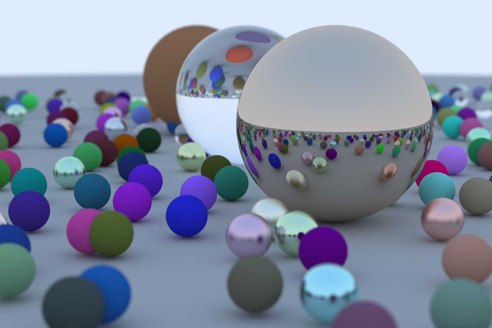

# rust-rt

rust-rt is a Rust implementaiton of the ray tracer developed throughout the [“Ray Tracing in One Weekend”](https://raytracing.github.io/books/RayTracingInOneWeekend.html) used as a learning experience for the Rust programming language.

## Usage

```bash
 cargo run > image_out.ppm
  ```
## Example Output:
